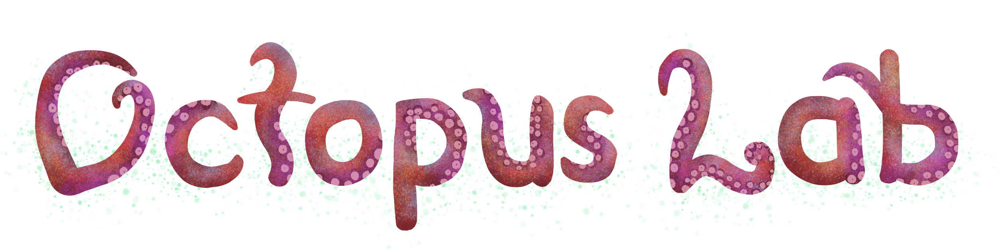

This repo holds the pipeline I use to render [the liquified octopus on my website](https://ryanis.cool). The main attraction is the renderer, which sets up a [LiquidFun](https://google.github.io/liquidfun/) environment to simulate the water particles and displays the results with [glium](https://docs.rs/glium).

There are also a few python scripts that generate the octopus outline for the renderer and to compress the final results.

## Renderer

I'm using [my own fork](https://github.com/rianadon/liquidfun-rust) of [a fork](https://github.com/Manishearth/liquidfun-rust) of [the Rust liquidfun bindings](https://github.com/rjanicek/liquidfun-rust) because that is what the open source do. Otherwise, the code and guide should be straightforward.

<p align="center"></p>

To run it, [install Rust](https://www.rust-lang.org/tools/install) and run:

```fish
gzip -dk segments.json.xz # Decompress this file
cargo run --release # Woohoo!
```

You'll see an octopus like the one above pop up! The renderer will set up the scene which takes some time, since it waits for particles to settle into place, and then it will run the simulation and save frames to `frames-rust.bin`.

I've put some care into this project since there exist few other Rust + LiquidFun projects and it may be interesting to generative artisters or game devvers. There's only about 300 lines of code here and it's split into two files:
- `src/main.rs`: Does the drawing! It retrieves world state from LiquidFun and draws everything.
- `src/model.rs`: Does the simulation! It sets up LiquidFun, adds particles, and records their positions to the file `frames-rust.bin`.

## Python files

> **Disclaimer**: Despite the cute title heading, the project from here on out is a mess.

There are a few dependencies you're going to need. I'm just including these files below (which I use for my website) in case they're of inspiration to anyone. If you'd actually like to run them, *good luck*.

- `draweyes.py` : Chooses pupils for the octopus's eyes by sampling eyeballs. Also sets up clipping paths and animations.
- `drawtrace.py`: Sets up that `segments.json` file for running the simulation. This script re-traces an svg file to get straight lines that can be rendered with LiquidFun.
- `drawframes.py`: Parses the simulation output to show you the results at the correct FPS. It also closes the holes in the frames (i.e. dilation then erosion) to help the file compress smaller; the holes appear randomly so add unnecessary entropy.
- `compression.py`: Compresses the resulting frames into new frames; more details are below!

## Compression

I spent a whole night trying various compression schemes and I'm very proud of my productivity and would like to tell you how it went. The frames, uncompressed, weigh about 30 MB. That's ... a lot for a website. But here's the magic: with some simple techniques™ I can *beat* Gzip's 2.2 MB (okay more like tie but I still win). And Gzipping-the compressed frames further halves the file size!

- Gzipping `frames-rust.bin`: 2.19 MB
- Special compression magic™: 2.17 MB
- Gzipping compression magic™: 1.29 MB

You can read more [here](compression.md) if you are tickled with curiosity.
